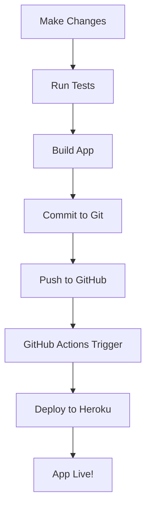

# 🚀 NeuroCal Auto-Deployment Guide

This guide explains how to set up automatic deployment to both **Heroku** and **GitHub** for your NeuroCal application.

## 📋 Prerequisites

- Node.js 18+ installed
- Git repository set up
- Heroku account (for Heroku deployment)
- GitHub account (for GitHub Actions)

## 🔧 Setup Instructions

### 1. Heroku Setup

#### Install Heroku CLI
```bash
# macOS (using Homebrew)
brew tap heroku/brew && brew install heroku

# Windows
# Download from: https://devcenter.heroku.com/articles/heroku-cli

# Linux
curl https://cli-assets.heroku.com/install.sh | sh
```

#### Login to Heroku
```bash
heroku login
```

#### Create Heroku App
```bash
# Create a new app
heroku create your-app-name

# Or use existing app
heroku git:remote -a your-app-name
```

#### Set Environment Variables (if needed)
```bash
heroku config:set NODE_ENV=production
heroku config:set PORT=8080
```

### 2. GitHub Actions Setup

#### Repository Secrets
Go to your GitHub repository → Settings → Secrets and variables → Actions, and add:

- `HEROKU_API_KEY`: Your Heroku API key (get from https://dashboard.heroku.com/account)
- `HEROKU_APP_NAME`: Your Heroku app name
- `HEROKU_EMAIL`: Your Heroku email

#### Get Heroku API Key
```bash
heroku authorizations:create
```

### 3. Automatic Deployment

#### Option 1: Using the Deploy Script (Recommended)
```bash
# Run the full deployment script
npm run deploy

# This will:
# 1. Run tests
# 2. Build the application
# 3. Commit and push to GitHub
# 4. Deploy to Heroku
```

#### Option 2: Manual Commands
```bash
# Deploy to Heroku only
npm run deploy:heroku

# Deploy to GitHub only
npm run deploy:github
```

#### Option 3: GitHub Actions (Automatic)
- Push to `main` branch
- GitHub Actions will automatically:
  - Run tests
  - Build the app
  - Deploy to Heroku

## 🔄 Deployment Flow



## 📁 File Structure

```
Neuro-Cal/
├── .github/
│   └── workflows/
│       └── deploy.yml          # GitHub Actions workflow
├── scripts/
│   └── deploy.sh              # Deployment script
├── Procfile                   # Heroku configuration
├── package.json               # NPM scripts
└── DEPLOYMENT.md             # This file
```

## 🚨 Troubleshooting

### Common Issues

#### 1. Heroku Build Fails
```bash
# Check build logs
heroku builds:info --app your-app-name

# Check app logs
heroku logs --tail --app your-app-name
```

#### 2. GitHub Actions Fail
- Check the Actions tab in your repository
- Verify all secrets are set correctly
- Check if the workflow file is in the right location

#### 3. Permission Denied
```bash
# Make deploy script executable
chmod +x scripts/deploy.sh
```

#### 4. Heroku CLI Not Found
```bash
# Install Heroku CLI (see prerequisites)
# Or use GitHub Actions only
```

### Debug Commands

```bash
# Check Heroku app status
heroku apps:info

# Check git remotes
git remote -v

# Check build status
heroku builds --app your-app-name

# View recent logs
heroku logs --tail --app your-app-name
```

## 🔐 Security Notes

- Never commit API keys or sensitive data
- Use environment variables for configuration
- Regularly rotate Heroku API keys
- Keep dependencies updated

## 📚 Additional Resources

- [Heroku Buildpacks](https://devcenter.heroku.com/articles/buildpacks)
- [GitHub Actions](https://docs.github.com/en/actions)
- [Heroku CLI](https://devcenter.heroku.com/articles/heroku-cli)
- [Vite Deployment](https://vitejs.dev/guide/static-deploy.html)

## 🎯 Quick Start

1. **First time setup:**
   ```bash
   heroku login
   heroku create your-app-name
   heroku git:remote -a your-app-name
   ```

2. **Set GitHub secrets** (see GitHub Actions Setup above)

3. **Deploy:**
   ```bash
   npm run deploy
   ```

4. **Your app is now live!** 🎉

---

**Need help?** Check the troubleshooting section or create an issue in the repository.
